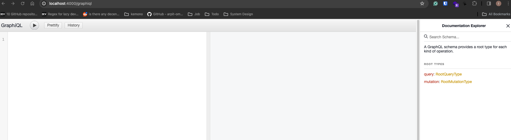

# How to Run

## Setup Redis Container (Optional)
If you don't have redis instance in your machine you can use docker container.
Run docker-compose.yaml
```
docker compose up -d
```
## How to start the application
### Make new env.sh file. Then copy content of env.sh.example
```
export REDIS_HOST = "localhost"
export REDIS_PORT = "6379"
export REDIS_USERNAME = "myuser"
export REDIS_PASSWORD = "mypassword"

export REDIS_HOST_TEST="localhost"
export REDIS_PORT_TEST="6380"
export REDIS_USERNAME_TEST="myuser"
export REDIS_PASSWORD_TEST="mypassword"
```
### Source the env.sh
```
source env.sh
```
### Download the dependency
```
mix deps.get
```

### Run the application
```
iex -S mix phx.server
```

## How to call the GraphQL
### Open the GraphiQL Inteface in browser
```
// local browser
http://localhost:4000/graphiql
```


### Set The Key Value Store
```
mutation {
  storeKeyValue(key: "coba", value: "test3"){
    key
    value
  }
}
```

### Get The Key Value Store
```
query {
  fetchKeyValue(key: "coba"){
    key
    value
  }
}
```